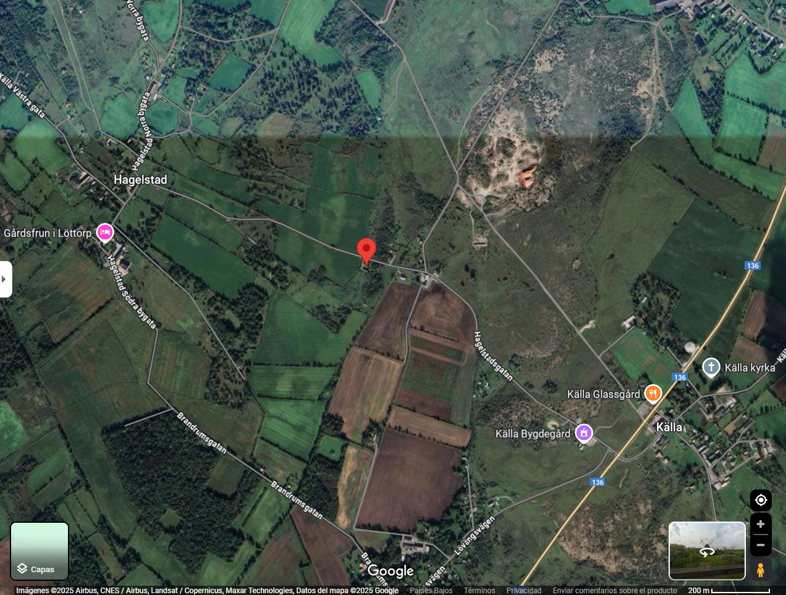

Autor del reto: `Suvoni, 0x157`

Dificultad: <font color=red>Difícil</font>

## Enunciado

"Fidget Spinner"

## Archivos

Este reto nos dan un enlace a una imagen panorámica del lugar.


Archivos utilizados [aquí](https://github.com/k3sero/Blog_Content/tree/main/Competiciones_Internacionales_Writeups/2025/L3AKCTF2025/Osint/fidget_spinner).

## Analizando el reto

Si analizamos la imagen panorámica, podemos observar una carretera rural estrecha y asfaltada que atraviesa un paisaje principalmente plano, con vegetación baja y algunos árboles dispersos. A un costado del camino hay un muro de piedra bajo que separa la vía de zonas de matorral y pastizales.

Lo que más nos llama la atención es un antiguo molino de viento de madera, con una base de piedra y aspas grandes (similares a un fidget spinner, de ahí el nombre en la interfaz). Este tipo de molino es típico de regiones del norte de Europa, especialmente de Suecia, Dinamarca o la costa del Báltico.

El entorno transmite una atmósfera tranquila y abierta, con grandes cielos despejados y pocas construcciones. A lo lejos se ven algunas casas rurales, posiblemente granjas.

Por último, la carretera parece poco transitada, más bien pensada para acceso local. La vegetación sugiere un clima templado-frío, probablemente en otoño o principios de invierno, porque los árboles están parcialmente sin hojas y la luz es baja y oblicua.

## Solución

Después de analizar la imagen, tenemos la siguiente información para encontrar el lugar.

```
Molino de viento antiguo de madera sobre base de piedra
Carretera rural asfaltada y estrecha, entre dos pueblos o zonas urbanas
Marcadores naranjas en la carretera
Muro de piedra bajo a un lado
Paisaje plano, campos abiertos y matorrales
Algunas casas dispersas en la distancia
Cielo muy amplio con nubes finas
Imágenes de google provenientes del 2021
```

Si nos centramos en el molino como principal punto de referencia, podemos encontrar que el diseño es muy típico del Báltico y Escandinavia, especialmente en `Öland y Gotland (Suecia)` ya que estas islas suecas tienen cientos de molinos casi idénticos, con base de piedra y estructura de madera oscura.

En otros lugares como `Saaremaa y Muhu (Estonia)` hay molinos históricos similares, junto a `Finlandia`

Además, si vemos la señal que se ve al fondo, esta señal se corresponde con el diseño de señales propio de Suecia, ya que cuentan con un borde rojo con un color sólido amarillo. Además, si buscamos el diseño de los postes anaranjados que se encuentran en la carretera, podemos observar como estos también se corresponden con los diseños propios de Suecia, por lo que vamos a comenzar nuestra búsqueda en dicho país, centrándonos en la isla de `Öland`.

Después de analizar la isla, podemos observar como coinciden todo lo mencionado anteriormente, el paisaje, los postes, los molinos tan similares, arquitectura en piedra, la naturaleza tan similar y la vegetación, por lo que podemos asegurar con certeza que estamos en la isla correcta.

Lo siguiente a analizar es que podemos encontrar en internet una [página web](https://milldatabase.org/states/sweden-summary-kalmar) que tiene registrados todos los molinos procedentes de la isla de `Oland`.


Según la página, tenemos unos 317 molinos en toda la isla, por lo cual nos tocará ir revisando uno a uno todos los molinos hasta poder ver el modelo exacto. En este caso podemos ir filtrando de manera más rápida sabiendo que hay pocos molinos en la isla con base de piedra caliza.

Después de un rato de búsqueda, finalmente podemos encontrar el molino.


La ubicación exacta se encuentra en una carretera local entre `Hagelstad` y `Kalla`, al norte de la isla.


## Flag
`L3AK{w1ndM1LL_1N_4_h4YSt4CK}`